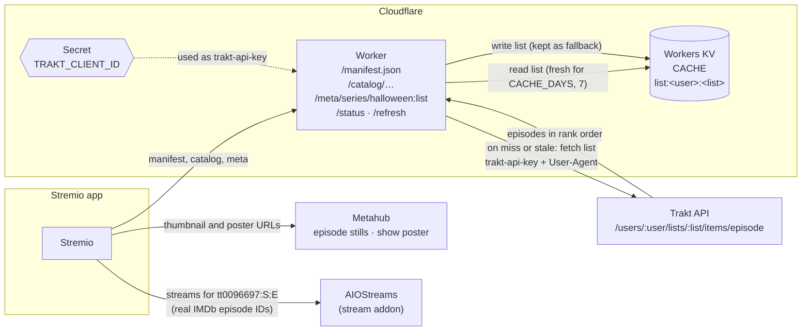

# Stremio Treehouse of Horror

A [Stremio](https://www.stremio.com/) addon that turns a public Trakt list of
individual episodes into **one show**: a single tile whose page lists every
episode in list order. This repo's
`wrangler.toml` points it at the list [`juicyj92/simpsons-halloween`](https://trakt.tv/users/juicyj92/lists/simpsons-halloween),
which collects The Simpsons "Treehouse of Horror" episodes.

It runs on Cloudflare Workers and caches the Trakt list in Workers KV.

## Contents

- [Architecture](#architecture)
- [How it works](#how-it-works)
- [Endpoints](#endpoints)
- [Project layout](#project-layout)
- [Configuration](#configuration)
- [Setup and deployment](#setup-and-deployment)
- [Installing in Stremio](#installing-in-stremio)
- [Testing](#testing)
- [Automated tests](#automated-tests)
- [Refreshing the list early](#refreshing-the-list-early)
- [Local development](#local-development)
- [Limitations](#limitations)
- [License](#license)

## Architecture



- **Stremio** asks the Worker for the manifest, the one catalog tile and the
  tile's episode list. It loads thumbnails and posters straight from Metahub.
- **The Worker** serves the list from **Workers KV** while it is younger than
  `CACHE_DAYS`. Otherwise it fetches it from **Trakt** using the
  `TRAKT_CLIENT_ID` secret, and stores the result. If Trakt fails, the last
  stored copy is served.
- **AIOStreams** (or any stream addon) never talks to this Worker. Stremio asks
  it for streams using each episode's real IMDb ID, such as `tt0096697:2:3`.

## How it works

1. The catalog endpoint fetches the Trakt list (all pages, in Trakt rank order)
   and returns **one tile**, `halloween:list`, named after `LIST_NAME`.
2. The tile's page lists every episode in Trakt order, numbered Episode 1..n,
   with its title, thumbnail and air date. Because the episodes are numbered
   in list order, Stremio's next-episode button and binge watching move
   through the list.
3. Each episode keeps its real IMDb episode ID (`<imdb>:<season>:<episode>`),
   so stream addons such as AIOStreams resolve it like any normal episode. The
   real `SxxEyy` code is shown at the start of each episode's description.
4. The list is cached in KV for 7 days (configurable). If Trakt fails, the
   last cached copy is served instead of an empty catalog.

## Endpoints

| Endpoint | Returns |
|---|---|
| `/` | Plain-text page with the manifest URL and a `stremio://` install link |
| `/manifest.json` | Addon manifest with one `series` catalog |
| `/catalog/series/trakt-episode-list.json` | The one tile for the list |
| `/meta/series/halloween:list.json` | The tile's page: every episode in Trakt order |
| `/status` | Episode count, where the list came from (cache or Trakt) and the last Trakt error. Use it when the catalog is empty |
| `/refresh/<your-refresh-token>` | Optional. Re-reads the Trakt list now instead of waiting for the cache to expire. See [Refreshing the list early](#refreshing-the-list-early) |

## Project layout

```
.
├── src/worker.js     # The whole addon: config, Trakt fetch, KV cache, routing
├── test/             # Unit tests (node --test)
├── .github/workflows # CI: runs the tests on pull requests
├── wrangler.toml     # Worker name, plain config vars, KV binding
├── package.json      # Wrangler dev dependency and npm scripts
└── README.md
```

## Configuration

### Plain variables (`wrangler.toml` → `[vars]`)

| Variable | Required | Value in this repo | Notes |
|---|---|---|---|
| `TRAKT_USER` | Yes | `juicyj92` | Trakt username that owns the list |
| `TRAKT_LIST` | Yes | `simpsons-halloween` | List slug |
| `LIST_NAME` | Yes | `Simpsons Halloween` | Name of the catalog row and the tile in Stremio |
| `CACHE_DAYS` | No | `7` | How long the cached list is considered fresh. Defaults to `7` |
| `STILL_URL_TEMPLATE` | No | Not set | Episode thumbnails. Uses `{imdb}`, `{season}`, `{episode}`. Defaults to Metahub episode stills; set to an empty string to use the show poster instead |

The Worker has no built-in values for the three required variables. If any is
missing, every request returns HTTP 500 with a JSON error naming what is missing.

### Secrets (Worker → Settings → Variables and Secrets)

| Secret | Required | Notes |
|---|---|---|
| `TRAKT_CLIENT_ID` | Yes | Client ID of your Trakt API app |
| `REFRESH_TOKEN` | No | A password you make up for the refresh link. See [Refreshing the list early](#refreshing-the-list-early) |

Store these as the **Secret** type so redeploys don't remove them, and never
commit them. The addon does not use your Trakt Client *Secret*.

### KV binding

| Binding | Purpose |
|---|---|
| `CACHE` | Stores the list under the key `list:<user>:<list>` |

## Setup and deployment

### 1. Prepare Trakt

1. Make sure the list is **Public**.
2. Create an app at <https://trakt.tv/oauth/applications>
   (redirect URI: `urn:ietf:wg:oauth:2.0:oob`) and copy its **Client ID**.
3. Set `TRAKT_USER`, `TRAKT_LIST` and `LIST_NAME` in `wrangler.toml` `[vars]`
   to match your list.

### 2. Create the KV namespace

`wrangler.toml` already points at this project's namespace
(`stremio-treehouse-of-horror-CACHE`). If you deploy to a different
Cloudflare account, create your own and put its `id` in `wrangler.toml`:

```sh
npm install
npx wrangler kv namespace create CACHE
```

### 3. Deploy from GitHub

In the Cloudflare dashboard go to **Workers & Pages → Create → Import a
repository**, pick this repo and keep the default deploy command
(`npx wrangler deploy`). Every push to `main` then redeploys automatically.

To deploy once from your machine instead, run `npm run deploy`.

### 4. Add the secrets

In the dashboard: **Worker → Settings → Variables and Secrets → Add**, type
**Secret**. Or from the terminal:

```sh
npx wrangler secret put TRAKT_CLIENT_ID
npx wrangler secret put REFRESH_TOKEN   # optional
```

## Installing in Stremio

This addon only provides the catalog tile and its episode list. To actually play
episodes you also need a **stream addon** installed, such as AIOStreams.

### Find your manifest URL

Open `https://<your-worker>.workers.dev/` in a browser. The page shows:

- the manifest URL: `https://<your-worker>.workers.dev/manifest.json`
- a one-click install link: `stremio://<your-worker>.workers.dev/manifest.json`

### Option A: one-click link (desktop)

With the Stremio desktop app installed, open the `stremio://` link from the
landing page. Stremio opens the addon page; click **Install**.

### Option B: paste the URL (desktop, web or Android)

1. Open Stremio (the app, or <https://web.stremio.com>) and sign in.
2. Go to **Addons**.
3. Paste the manifest URL into the search box at the top of the Addons page
   and press Enter.
4. Click **Install** on the addon that appears.

Because addons are saved to your Stremio account, installing it once makes it
available on every device signed in to that account.

### Option C: through AIOStreams

If you manage your addons with AIOStreams, add the manifest URL there as a
**catalog** addon instead, and reinstall your AIOStreams manifest in Stremio
if prompted.

### Where to find it

After installing, the **Simpsons Halloween** row (or whatever `LIST_NAME` is
set to) appears on the Stremio **Board** and under **Discover → Series**, with
one tile. Open it, pick an episode, and your stream addon lists sources.

### Uninstalling

Go to **Addons → Installed**, find the addon and click **Uninstall**.

## Testing

1. Open `/manifest.json` and confirm it loads.
2. Open `/status` and check the episode count matches your list.
3. Open `/meta/series/halloween:list.json` and check your episodes are listed.
4. In Stremio, open the tile, pick Episode 1 (S02E03) and press play. Streams
   should appear. Let it finish, or skip to the end, to check the next episode
   follows.
5. Open one episode `thumbnail` URL from step 3 in a browser. If it returns
   404, change `STILL_URL_TEMPLATE` or set it to an empty string.

## Automated tests

Unit tests live in `test/` and use Node's built-in test runner, so they need
no extra dependencies. They mock Trakt and KV and cover the manifest, catalog,
episode list, status, refresh and cache paths, plus the missing-config error.

```sh
npm test
```

GitHub Actions runs them on every pull request and every push to `main`
(see `.github/workflows/test.yml`).

## Refreshing the list early

The Worker re-reads the Trakt list from Trakt at most once every
`CACHE_DAYS` (7). To pick up list changes sooner, use either option.

### Option A: a refresh link (optional)

`REFRESH_TOKEN` is not a Trakt or Cloudflare token. It is a password you
make up, so that only you can trigger a refresh.

1. Make up a long random string, for example with `openssl rand -hex 32`.
2. Save it as a Worker secret named `REFRESH_TOKEN` (**Settings → Variables
   and Secrets → Add**, type **Secret**, or `npx wrangler secret put REFRESH_TOKEN`).
3. Whenever you change the list, open
   `https://<your-worker>.workers.dev/refresh/<the string you made up>`.
   It re-reads the list from Trakt and returns
   `{"refreshed":true,"episodes":35}`.

If `REFRESH_TOKEN` is not set, or the string in the link doesn't match, the
link returns 404 and nothing happens. You can skip this entirely.

### Option B: clear the cache

In the Cloudflare dashboard go to **Storage & Databases → Workers KV →
stremio-treehouse-of-horror-CACHE** and delete the key `list:<user>:<list>`
(here `list:juicyj92:simpsons-halloween`). The next request fetches the list
from Trakt again.

## Local development

```sh
npm install
echo 'TRAKT_CLIENT_ID=your-client-id' > .dev.vars   # git-ignored
npm run dev
```

Then open <http://localhost:8787/manifest.json>.

## Limitations

- New list items appear only after the cache expires, unless you refresh it.
- Episode stills rely on a third-party URL pattern (Metahub).
- Auto-playing the next episode is up to Stremio: turn on its binge-watching
  setting, and Stremio only picks the next stream automatically when it has
  the same `bingeGroup` as the current one (set by your stream addon, e.g.
  AIOStreams). Otherwise you get the next-episode prompt and choose a stream.
- Episodes are numbered 1..n in list order rather than by their real season,
  so the next episode follows the list. The real `SxxEyy` is in each
  description.
- Newly aired episodes may have no Metahub still yet, so their thumbnail can
  be blank for a while.

## License

[MIT](LICENSE)
